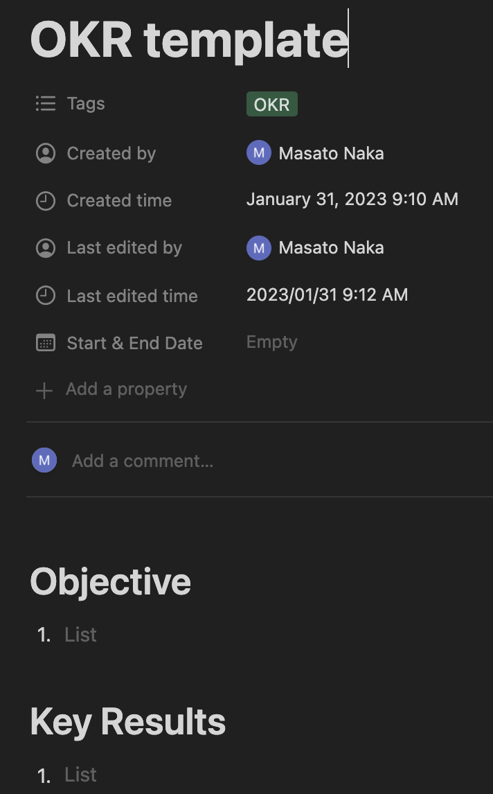
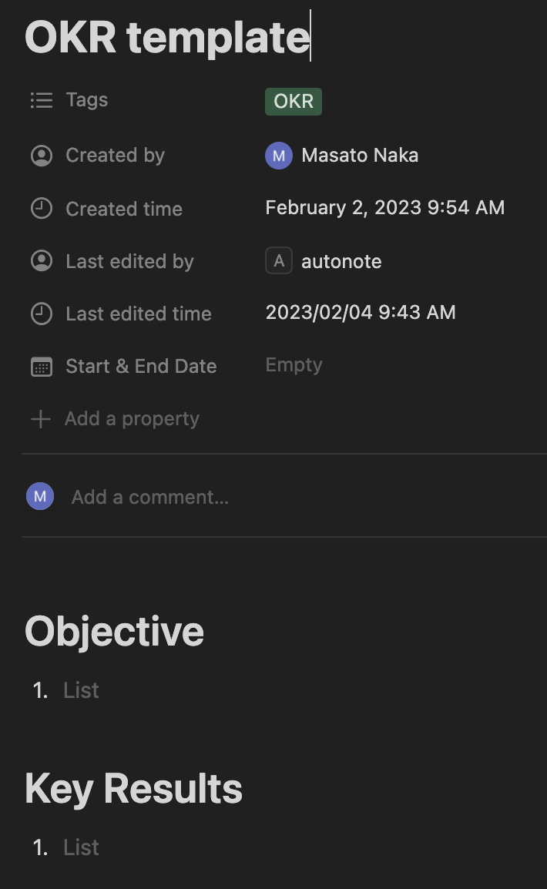

# autonote

## Description


Automate creating daily, weekly, monthly, and quarterly manual repetitive documents:

1. Daily: daily journal, habit tracker
1. Weekly: weekly report
1. Monthly: monthly report
1. Quarterly: quarterly review

## Prerequisite

1. Confluence API Token
1. Notion Integration Token

## Installation

```
pip install autonote
```

## Usage

### 1. Confluence

#### 1.1. Create a confluence page

Currently only support pre-defined page. TODO: make it configurable

1. Set environment variables:

    ```
    export CONFLUENCE_URL=https://xxx.atlassian.net
    export CONFLUENCE_USERNAME=<yourname>@domain.com
    export CONFLUENCE_PASSWORD=<TOKEN>
    ```

1. Run
    ```python
    from autonote.confluence import ConfluenceClient
    from autonote.html import generate

    content = generate()
    client = ConfluenceClient()
    client.create_page(
        parent_page_id="<confluence_parent_page_id>",
        title="title",
        body=content,
    )
    ```

    Generated Page:

    <table><tr><td>
    
    </td></tr></table>

### 2. Notion

Prerequisite: Set environemnt variable

```
export NOTION_INTEGRATION_TOKEN=xxx
```

#### 2.1. Create a Notion page

```python
from autonote.notion import NotionClient

client = NotionClient()
client.create_page(
    parent_page_id="<parent_page_id>",
    title="title",
    body="body",
    override=True, # update if exists
)
```

Generated page:

<table><tr><td>

</td></tr></table>


#### 2.2. Create Notion database page from a template

```python
from autonote.notion import NotionClient

client = NotionClient()
client.create_page_from_template(
    template_id="<template_id>",
    title="OKR 2023Q1",
    override=True,
)
```

Template page:

<table><tr><td>

</td></tr></table>

Generated page:

<table><tr><td>

</td></tr></table>


## Credits

`autonote` was created with [`cookiecutter`](https://cookiecutter.readthedocs.io/en/latest/) and the `py-pkgs-cookiecutter` [template](https://github.com/py-pkgs/py-pkgs-cookiecutter).

## Contributing

Interested in contributing? Check out the contributing guidelines. Please note that this project is released with a Code of Conduct. By contributing to this project, you agree to abide by its terms.

## License

`autonote` was created by Masato Naka. It is licensed under the terms of the MIT license.

## References
1. [Atlassian Python API Confluence module](https://atlassian-python-api.readthedocs.io/confluence.html)
1. [notion-client](https://pypi.org/project/notion-client/)
1. [Notion API](https://developers.notion.com/)
