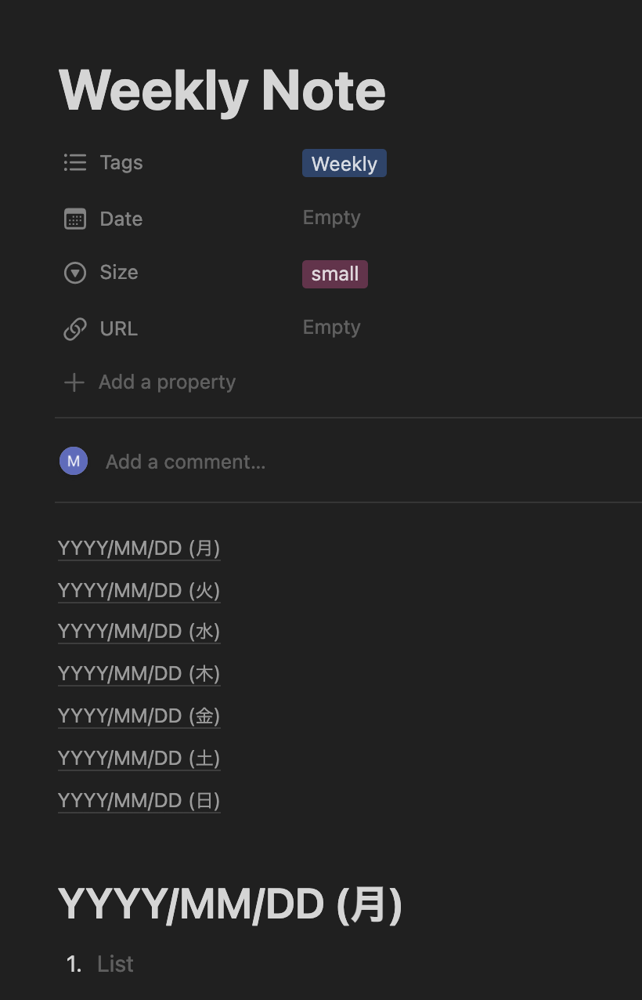

# autonote

[](https://codecov.io/gh/nakamasato/autonote)

## Description


Automate creating daily, weekly, monthly, and quarterly manual repetitive documents:

1. Daily: daily journal, habit tracker
1. Weekly: weekly report
1. Monthly: monthly report
1. Quarterly: quarterly review

## Prerequisite

1. [Confluence API Token](https://support.atlassian.com/atlassian-account/docs/manage-api-tokens-for-your-atlassian-account/)

    ```
    export CONFLUENCE_URL=https://xxx.atlassian.net
    export CONFLUENCE_USERNAME=<yourname>@domain.com
    export CONFLUENCE_PASSWORD=<TOKEN>
    ```
1. [Notion Integration Token](https://developers.notion.com/docs/authorization)

    ```
    export NOTION_INTEGRATION_TOKEN=xxx
    ```
    
    Please do not forget to [share the target database/page with your integration](https://developers.notion.com/docs/create-a-notion-integration#step-2-share-a-database-with-your-integration)

## Installation

```
pip install autonote
```

## Usage Example (Notion: Create a page from a template.)

1. Create a template page.

    <table><tr><td>
    
    </td></tr></table>

1. Prepare Python script.

    ```python
    from autonote.notion import NotionClient

    client = NotionClient()

    kwargs = {
        "Date": {"start": "2023-02-04", "end": "2023-02-10"},
        "replace_rules": [
            {
                "block_types": ["heading_1"],  # target blocks to apply replacement
                "replace_str": "YYYY/MM/DD",  # replacement string match
                "replace_type": "datetime",  # currently only support "datetime"
                "date_format": "%Y/%m/%d",  # used to parse `start_date` and generate string from datetime when interpolating
                "start_date": "2023/02/04",  # start date
                "increment": True,  # if true, increment 1 day every time replacement is executed
            },
        ],
    }
    client.create_page_from_template(
        template_id="a7cc4f73460c4b9fa82be8d4ed74d8ca",
        title="weekly note",
        override=True,
        **kwargs
    )
    ```

1. Run the script.
    ```
    pip install autonote
    python main.py
    ```

    Generated page:
    <table><tr><td>
    
    </td></tr></table>


For more examples, please check [examples](examples/README.md).

## Credits

`autonote` was created with [`cookiecutter`](https://cookiecutter.readthedocs.io/en/latest/) and the `py-pkgs-cookiecutter` [template](https://github.com/py-pkgs/py-pkgs-cookiecutter).

## License

`autonote` was created by Masato Naka. It is licensed under the terms of the MIT license.

## References
1. [Atlassian Python API Confluence module](https://atlassian-python-api.readthedocs.io/confluence.html)
1. [notion-client](https://pypi.org/project/notion-client/)
1. [Notion API](https://developers.notion.com/)
