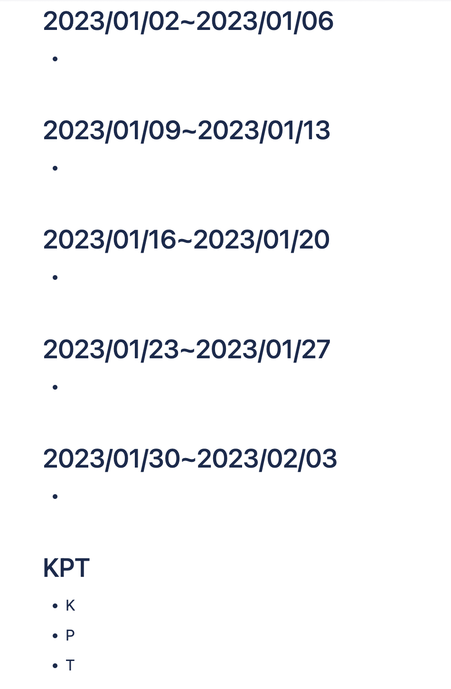

# autonote

## Description


Automate creating daily, weekly, monthly, and quarterly manual repetitive documents:

1. Daily: daily journal, habit tracker
1. Weekly: weekly report
1. Monthly: monthly report
1. Quarterly: quarterly review

## Prerequisite

1. Confluence API Token
1. Notion Integration Token

## Installation

```
pip install autonote
```

## Usage

### Create Confluence Page

Currently only support pre-defined page. TODO: make it configurable

1. Set environment variables:

    ```
    export CONFLUENCE_URL=https://xxx.atlassian.net
    export CONFLUENCE_USERNAME=<yourname>@domain.com
    export CONFLUENCE_PASSWORD=<TOKEN>
    ```

1. Run
    ```python
    from autonote.confluence import ConfluenceClient
    from autonote.html import generate

    content = generate()
    client = ConfluenceClient()
    client.create_page(
        <confluence_parent_page_id>,
        title="title",
        body=content,
    )
    ```

    Generated Page:

    <table><tr><td>
    
    </td></tr></table>

### Create Notion Page

Currently only support hardcoded page. TODO: make it configurable

1. Set environemnt variable

    ```
    export NOTION_INTEGRATION_TOKEN=xxx
    ```

1. Run
    ```python
    from autonote.notion import NotionClient
    from autonote.html import generate

    content = generate()
    client = ConfluenceClient()
    client.create_page(
        <notion_parent_page_id>,
        title="title",
        body=content,
    )
    ```

## Credits

`autonote` was created with [`cookiecutter`](https://cookiecutter.readthedocs.io/en/latest/) and the `py-pkgs-cookiecutter` [template](https://github.com/py-pkgs/py-pkgs-cookiecutter).

## Contributing

Interested in contributing? Check out the contributing guidelines. Please note that this project is released with a Code of Conduct. By contributing to this project, you agree to abide by its terms.

## License

`autonote` was created by Masato Naka. It is licensed under the terms of the MIT license.

## References
1. [How to package a Python](https://py-pkgs.org/03-how-to-package-a-python)
1. [py-pkgs-cookiecutter](https://github.com/py-pkgs/py-pkgs-cookiecutter)
1. [package](https://packaging.python.org/en/latest/tutorials/packaging-projects/)
1. [Atlassian Python API Confluence module](https://atlassian-python-api.readthedocs.io/confluence.html)
1. [notion-client](https://pypi.org/project/notion-client/)
