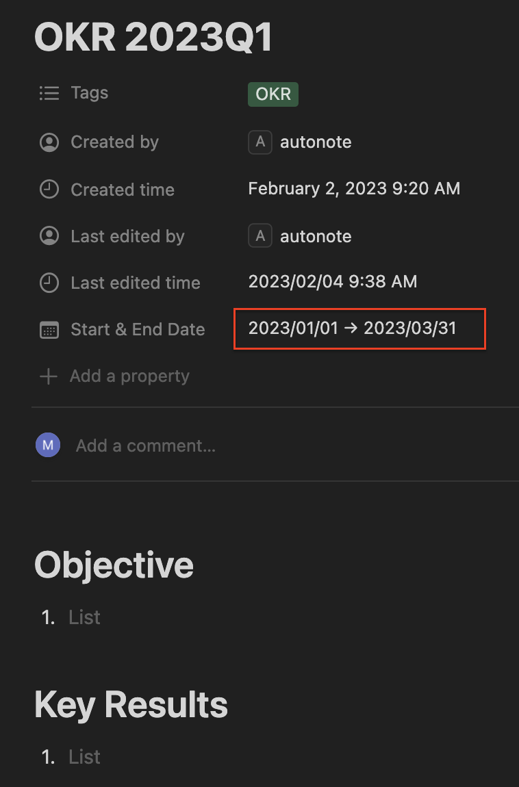

# Examples

## 1. Confluence

### 1.1. Create a confluence page

Currently only support pre-defined page. TODO: make it configurable

1. Set environment variables:

    ```
    export CONFLUENCE_URL=https://xxx.atlassian.net
    export CONFLUENCE_USERNAME=<yourname>@domain.com
    export CONFLUENCE_PASSWORD=<TOKEN>
    ```

1. Run
    ```python
    from autonote.confluence import ConfluenceClient
    from autonote.html import generate

    content = generate()
    client = ConfluenceClient()
    client.create_page(
        parent_page_id="<confluence_parent_page_id>",
        title="title",
        body=content,
    )
    ```

    Generated Page:

    <table><tr><td>
    
    </td></tr></table>

## 2. Notion

Prerequisite: Set environemnt variable

```
export NOTION_INTEGRATION_TOKEN=xxx
```

### 2.1. Create a Notion page

```python
from autonote.notion import NotionClient

client = NotionClient()
client.create_page(
    parent_page_id="<parent_page_id>",
    title="title",
    body="body",
    override=True, # update if exists
)
```

Generated page:

<table><tr><td>

</td></tr></table>


### 2.2. Create Notion database page from a template

```python
from autonote.notion import NotionClient

client = NotionClient()
client.create_page_from_template(
    template_id="<template_id>",
    title="OKR 2023Q1",
    override=True,
)
```

Template page:

<table><tr><td>

</td></tr></table>

Generated page:

<table><tr><td>

</td></tr></table>

## 2.3. Create Notion page from a template with dynamic values

```python
from autonote.notion import NotionClient

client = NotionClient()
kwargs={"Date": {"start": "2023-01-01", "end": "2023-03-31"}}
client.create_page_from_template(
    template_id="<template_id>",
    title="OKR 2023Q1",
    override=True,
    **kwargs
)
```

<table><tr><td>

</td></tr></table>

## 2.3. Create Notion page from a template with dynamic values

```python
from autonote.notion import NotionClient

client = NotionClient()
kwargs={"Date": {"start": "2023-01-01", "end": "2023-03-31"}}
client.create_page_from_template(
    template_id="<template_id>",
    title="OKR 2023Q1",
    override=True,
    **kwargs
)
```

<table><tr><td>

</td></tr></table>

## 2.3. Create Notion page from a template with dynamic values (properties)

```python
from autonote.notion import NotionClient

client = NotionClient()
kwargs={"Date": {"start": "2023-01-01", "end": "2023-03-31"}}
client.create_page_from_template(
    template_id="<template_id>",
    title="OKR 2023Q1",
    override=True,
    **kwargs
)
```

<table><tr><td>

</td></tr></table>

## 2.4. Create Notion page from a templae with dynamic values (content)

```python
from autonote.notion import NotionClient

client = NotionClient()

kwargs = {
    "Date": {"start": "2023-02-04", "end": "2023-02-10"},
    "replace_rules": [
        {
            "block_types": ["heading_1"],  # target blocks to apply replacement
            "replace_str": "YYYY/MM/DD",  # replacement string match
            "replace_type": "datetime",  # currently only support "datetime"
            "date_format": "%Y/%m/%d",  # used to parse `start_date` and generate string from datetime when interpolating
            "start_date": "2023/02/04",  # start date
            "increment": True,  # if true, increment 1 day every time replacement is executed
        },
    ],
}
client.create_page_from_template(
    template_id="a7cc4f73460c4b9fa82be8d4ed74d8ca",
    title="weekly note",
    override=True,
    **kwargs
)
```

Template:

<table><tr><td>

</td></tr></table>

Generated page:

<table><tr><td>

</td></tr></table>
